# 🛡️ Cloud SOC: Detection & Incident Response Lab
### Microsoft Sentinel + Microsoft Entra ID (Simulated Environment)

A hands-on Security Operations lab that builds a working detection pipeline in Microsoft Sentinel: ingesting identity logs, hunting through them with KQL, and creating an automated analytics rule that detects a privilege-escalation attack and raises a real incident on its own.

---

## 📌 Overview

This project sets up **Microsoft Sentinel** (Azure's cloud SIEM) on top of a **Log Analytics workspace**, connects **Microsoft Entra ID** logs as a data source, and then uses that data to build and test a real detection.

The scenario reuses a fictional company, **Lakeshore Financial**, from a previous Identity & Access Management lab. In that project, a suspicious privilege escalation (a test account added to a high-privilege security group) had to be caught *manually* by reading audit logs. This project fixes that gap: here, the same attack is detected **automatically** by a scheduled analytics rule that fires an incident the moment it happens.

> ⚠️ **Disclaimer:** This is a simulated lab environment built for learning and portfolio purposes. No real company data or systems were used. All users are fictional test accounts.

---

## 🎯 What This Lab Demonstrates

- Deploying Microsoft Sentinel on a Log Analytics workspace
- Connecting Microsoft Entra ID as a log source (sign-in and audit logs)
- Writing **KQL (Kusto Query Language)** to hunt through security logs
- Extracting fields from nested JSON in audit data
- Building a **scheduled analytics rule** to detect privilege escalation
- Triggering the attack and watching Sentinel raise an **incident** automatically
- Triaging an incident end to end (assign, investigate, close with classification)
- Adding **entity mapping** so incidents link to the affected user
- Mapping the detection to the **MITRE ATT&CK** Privilege Escalation tactic

---

## 🏗️ Environment & Cost Control

- **SIEM:** Microsoft Sentinel
- **Log store:** Log Analytics workspace (`law-lakeshore-soc`)
- **Log source:** Microsoft Entra ID (sign-in + audit logs)
- **Subscription:** Azure for Students
- **Region:** East US

All resources were scoped to a single resource group (`rg-lakeshore-soc`) for clean teardown and cost control. A monthly **budget alert** was configured *before* deploying anything, so any spend would trigger an email well before becoming a problem. Total project cost stayed near zero.

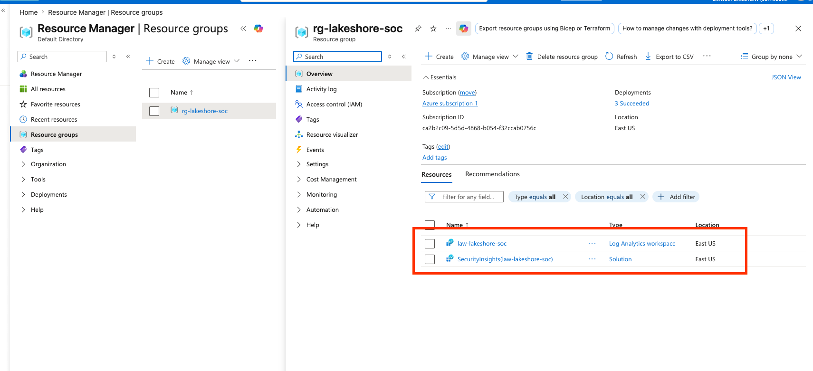
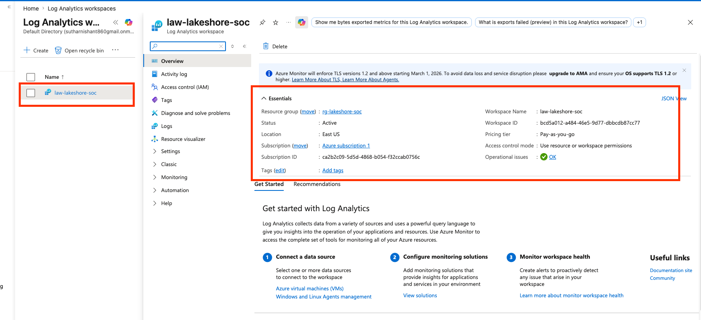

---

## 🔌 Session 1 — Building the Pipeline

**Goal:** get identity logs flowing into Sentinel so there is data to detect against.

Steps taken:
1. Created the Log Analytics workspace and enabled Microsoft Sentinel on it
2. Connected the Microsoft Entra ID data connector
3. Verified logs were flowing by querying the `SigninLogs` table

A key lesson here: **data connectors are not retroactive.** They only collect events generated *after* the connector is enabled, so older activity from the previous project never appeared in Sentinel. This mattered later when hunting for the original attack.

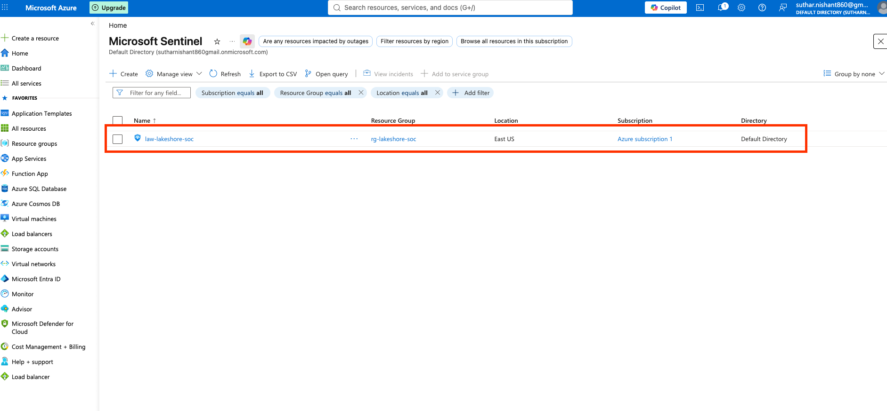
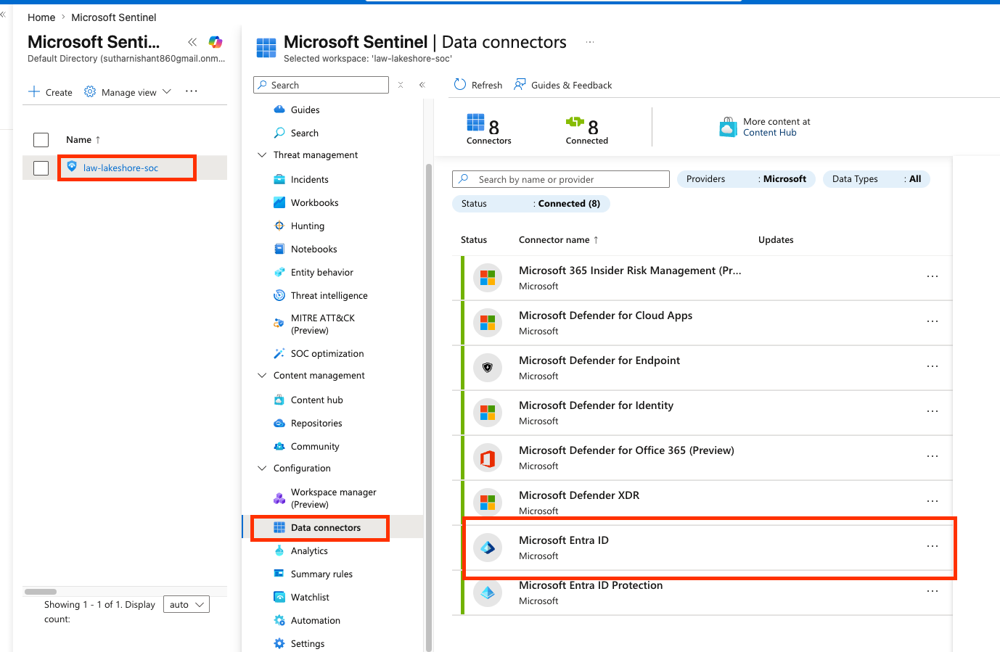
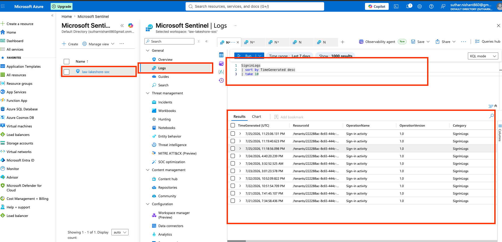

---

## 🔍 Session 2 — Hunting with KQL

**Goal:** learn to query and filter the logs the way a SOC analyst does.

**Most recent sign-ins** — sorting and limiting results:

```kql
SigninLogs
| sort by TimeGenerated desc
| take 10
```

**Failed sign-ins** — filtering with `where`. A successful sign-in has `ResultType == "0"`, so anything else is a failure:

```kql
SigninLogs
| where ResultType != "0"
| project TimeGenerated, UserPrincipalName, ResultType, IPAddress
```

This surfaces repeated failures from the same account, which is the pattern behind a brute-force attempt.

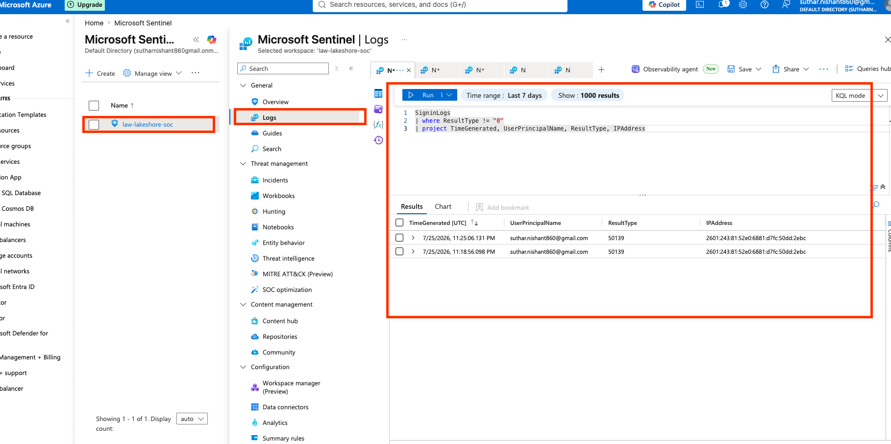

**Verifying the data before hunting** — instead of assuming an operation name, `distinct` lists every operation actually present in the audit logs:

```kql
AuditLogs
| distinct OperationName
```

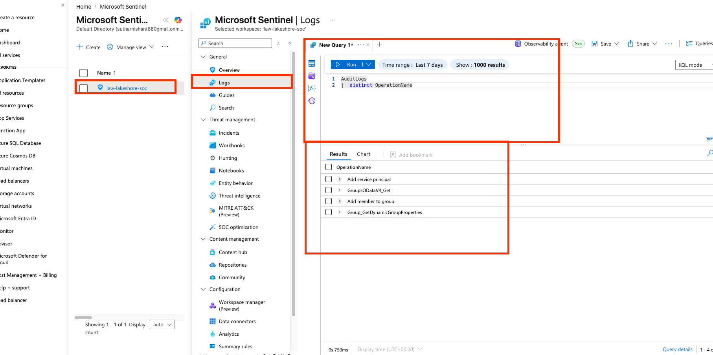

**Finding the group-change events** and extracting the target user out of the nested `TargetResources` JSON using `mv-expand` and `extend`:

```kql
AuditLogs
| where OperationName == "Add member to group"
| mv-expand TargetResources
| extend TargetUser = tostring(TargetResources.userPrincipalName)
| project TimeGenerated, OperationName, Identity, TargetUser
```

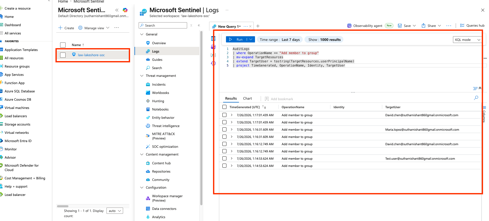

---

## 🚨 Session 3 — Automated Detection

**Goal:** turn the hunting query into a rule that runs itself and raises an incident.

**The detection logic.** The query was narrowed to fire only when a user is added to the high-privilege **IT-Security** group, not on every group change. The group name is also buried in nested JSON, extracted the same way:

```kql
AuditLogs
| where OperationName == "Add member to group"
| mv-expand TargetResources
| extend TargetUser = tostring(TargetResources.userPrincipalName)
| extend GroupName = tostring(TargetResources.modifiedProperties[1].newValue)
| where GroupName contains "IT-Security"
| project TimeGenerated, OperationName, Identity, TargetUser, GroupName
```

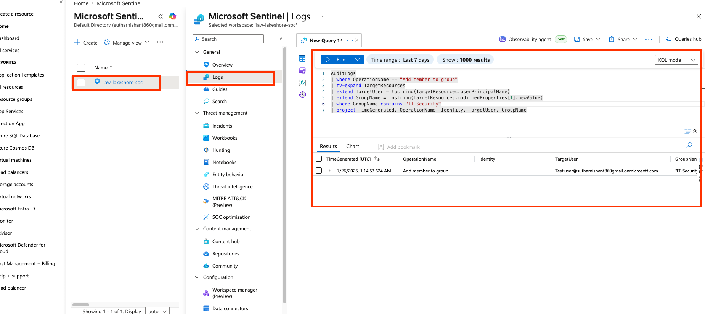

**The analytics rule.** This query was saved as a scheduled analytics rule: **High** severity, mapped to the **Privilege Escalation** MITRE ATT&CK tactic, running on a short schedule.

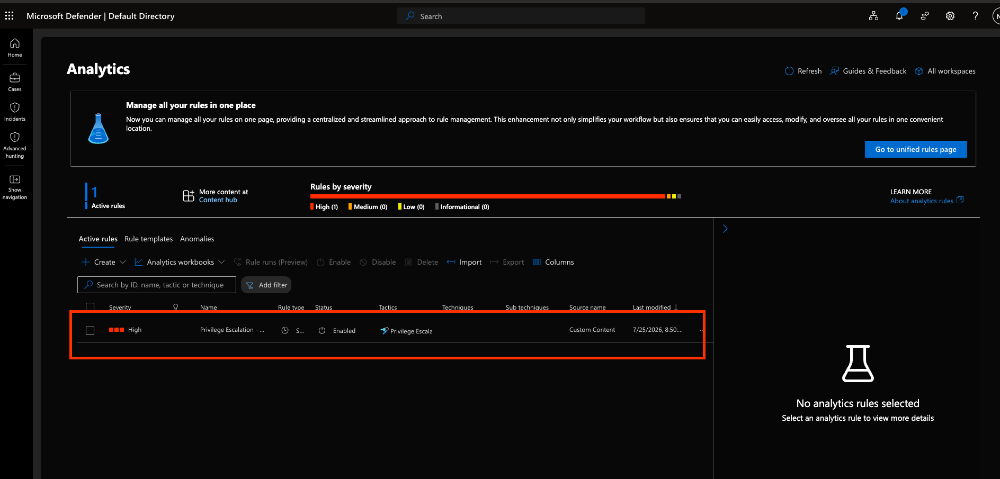

**Testing it.** Re-running the attack (adding a test account to IT-Security) caused Sentinel to raise incidents automatically, with no manual log review. This is the core difference from the earlier manual approach.

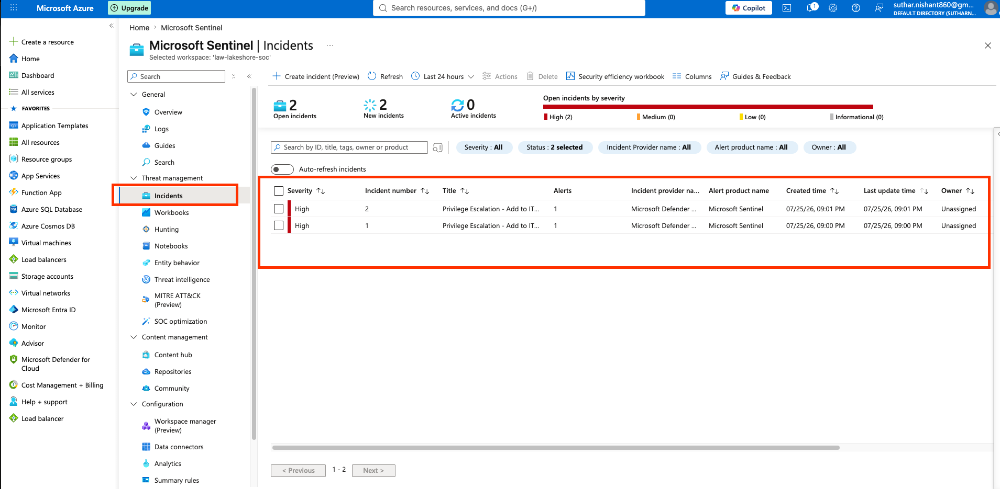

**Triage.** The incident was worked end to end like a real analyst would: reviewed, assigned to an owner, and closed with a classification of **True Positive - Suspicious activity**.

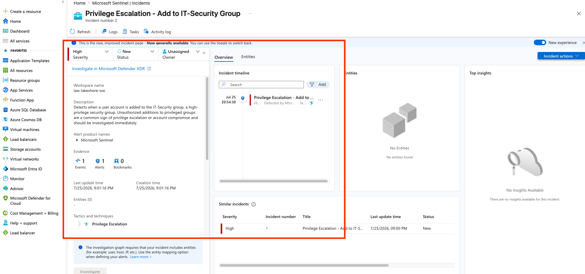
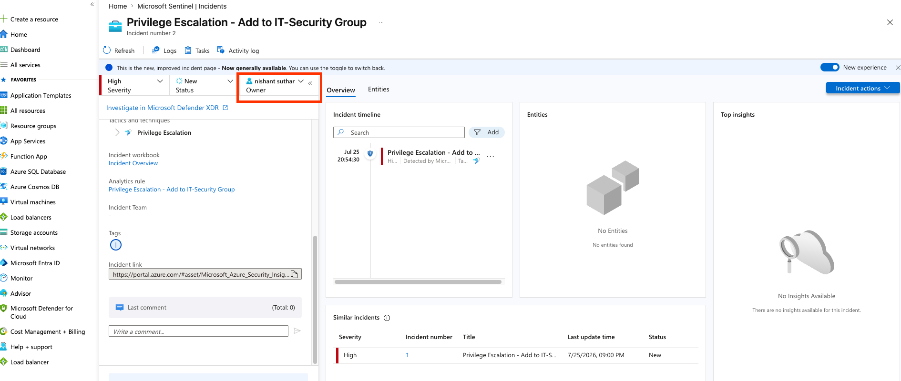
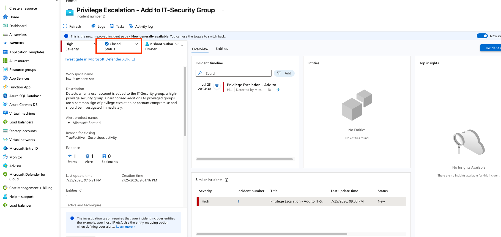

---

## 🧩 Session 4 — Improving the Detection (Entity Mapping)

The first version of the rule fired correctly but showed **"No Entities"** on the incident, meaning it did not link to the specific user involved. Adding **entity mapping** (mapping the `TargetUser` column to an Account entity) fixed this. New incidents now link directly to the affected account, so an analyst can pivot straight to the user and investigate.

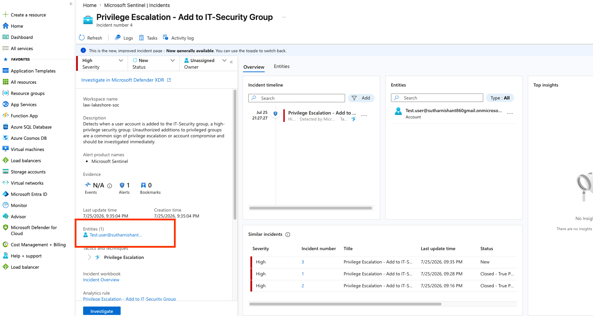

---

## 🧠 Key Takeaways

- A SIEM is only useful once data is flowing and someone builds detections on it; ingesting logs is the setup, not the goal
- KQL is the core skill for this stack: filtering, projecting, and extracting nested fields to turn raw logs into answers
- Automated analytics rules move detection from "an analyst has to go look" to "the system pages you," which is the entire point of a SOC
- Detections should be tuned to fire on what matters (a privileged group) rather than on everything, to avoid alert fatigue
- Small details make a detection usable: entity mapping is what lets an analyst actually investigate an alert
- Troubleshooting is a real skill: checking time ranges, verifying data exists, and understanding that connectors don't back-fill

---

## 🚀 Future Improvements

- Add an automated response **playbook** (Logic App) to auto-disable an account when the rule fires (SOAR)
- Add near-real-time (NRT) rules for faster detection than the scheduled interval
- Build a **workbook** dashboard to visualize sign-in failures and privileged group changes over time
- Expand detections to cover more MITRE ATT&CK techniques (impossible-travel sign-ins, mass failed logins)

---

## Note on Screenshots

Some screenshots have identifying details (email addresses, IP addresses) blurred for privacy. This is a personal lab tenant with fictional test users; the redactions follow standard data-hygiene practice.
